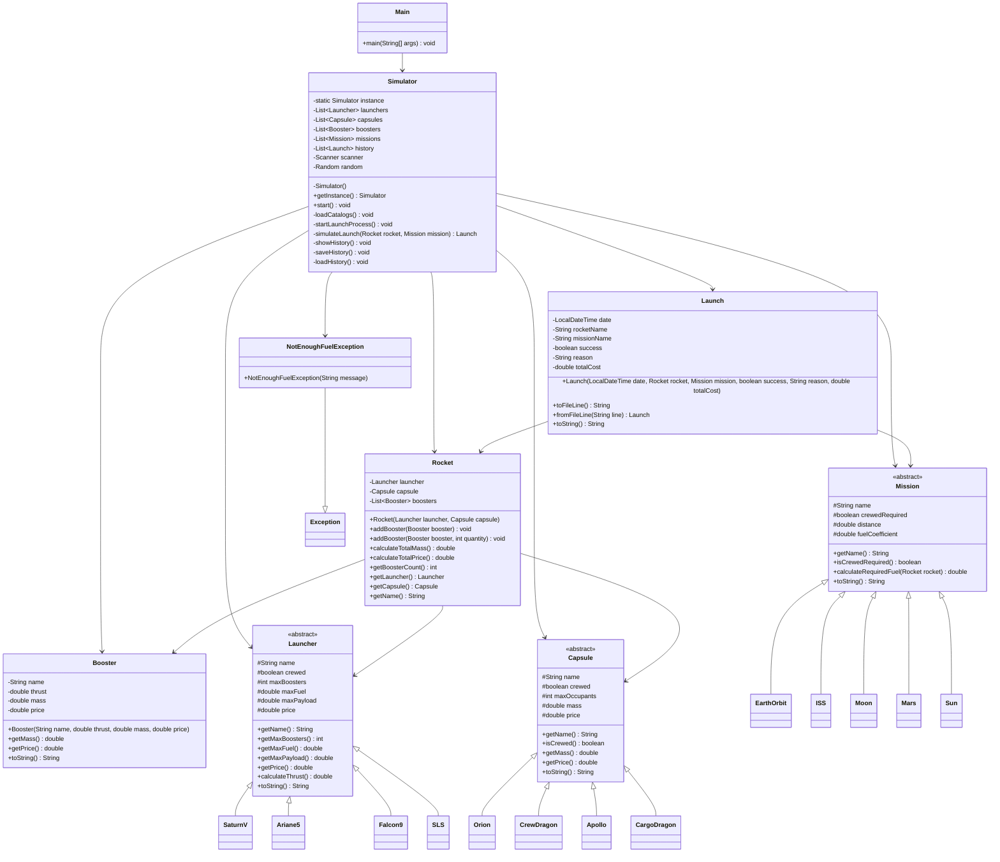

# Space Launch Simulator

git clone https://github.com/HaxTwoWater/Fusee.git

## Description

Space Launch Simulator is a Java console application that simulates rocket launches.

The user can:
- Configure a rocket (launcher, capsule, boosters)
- Choose a mission
- Launch a simulation
- Get a result (success or failure with reason)
- View launch history

---

## Architecture

Main.java
Models.java
Rocket.java
Launch.java
Simulator.java

---

## Main.java

Entry point of the program.

public class Main {
    public static void main(String[] args) {
        Simulator simulator = Simulator.getInstance();
        simulator.start();
    }
}

---

## Models.java

Contains:
- Launcher (abstract) + subclasses
- Capsule (abstract) + subclasses
- Mission (abstract) + subclasses
- Booster

---

## Rocket.java

Represents a rocket composed of:
- Launcher
- Capsule
- Boosters

Handles:
- Total mass calculation
- Total price calculation

---

## Launch.java

Represents a launch result:
- Date
- Rocket name
- Mission name
- Success / failure
- Reason
- Total cost

Used for history storage.

---

## Simulator.java

Handles:
- Menu
- User choices
- Simulation logic
- History management
- File saving/loading

---

## POO Concepts

Inheritance:
class SaturnV extends Launcher

Composition:
Rocket has Launcher, Capsule, Boosters

Polymorphism:
List<Launcher>

Encapsulation:
Getters used

Exception:
NotEnoughFuelException

---

## Simulation Logic

fuel = (mass × distance × coefficient) / 1000

Failure conditions:
- Not enough fuel
- Payload exceeded
- Too many boosters
- Incompatible capsule
- Random failure (5%)

---

## History

Saved in history.txt

Format:
date;rocket;mission;success;reason;cost

---

## Run

javac *.java
java Main

## Diagramme UML

## AI declaration

Mostly used for the readme :p